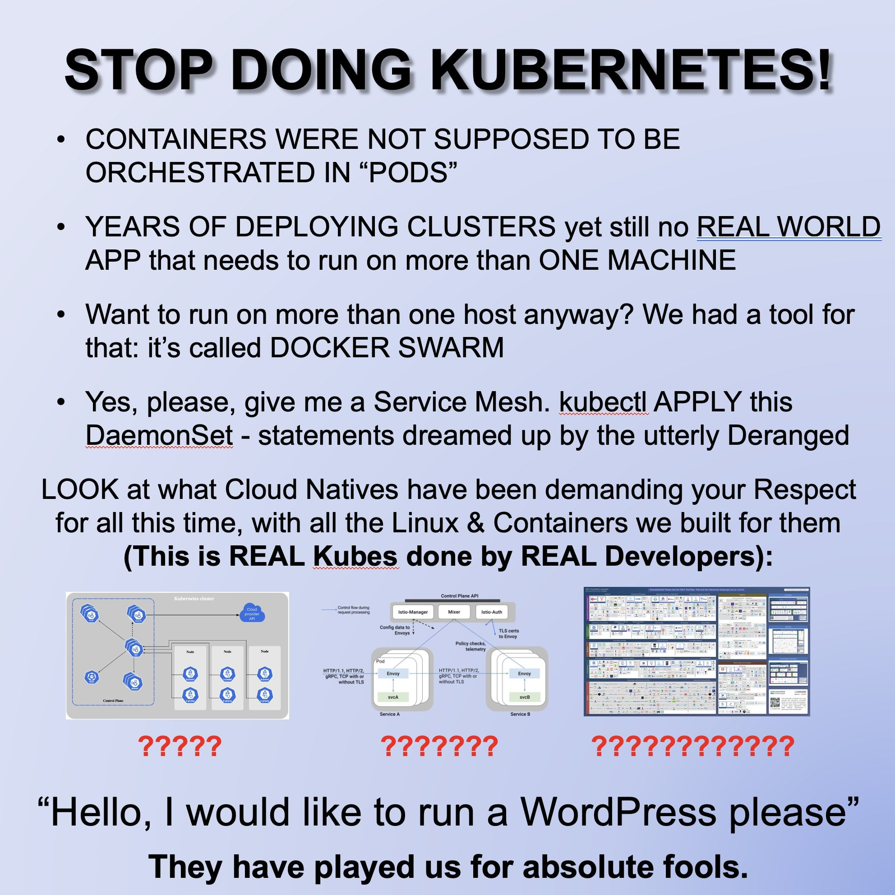
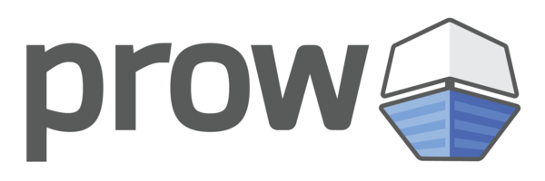
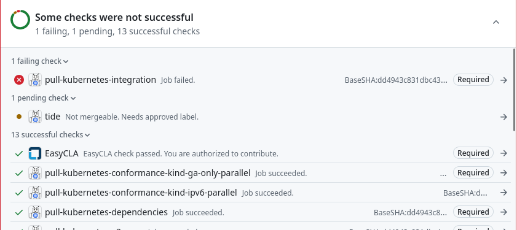
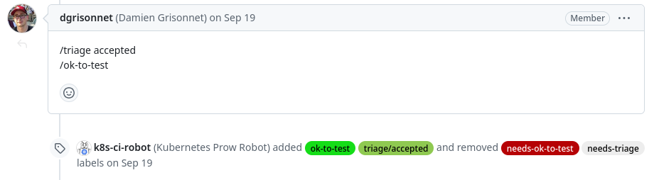
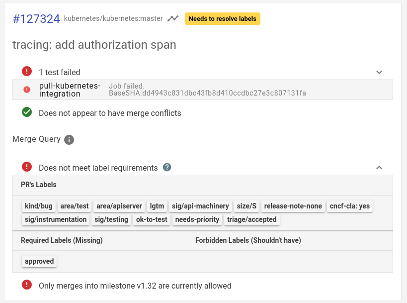
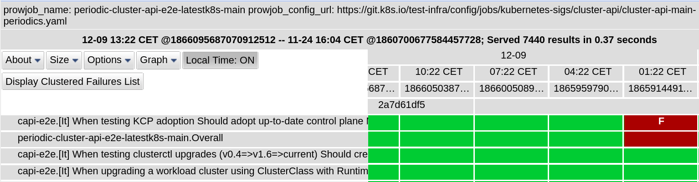

## Developing Kubernetes with Kubernetes
<br>
<br>
<br>
Vadim Rutkovsky

vrutkovs@redhat.com

---
<!-- .slide: class="two-floating-elements" -->
### `whoami`

* Principal software engineer living in Czech Republic.

* Working for Red Hat in the OpenShift department.


Note:

My dayjob is working on control plane components - kube-apiserver mostly, but along the way I 
contribute to several other projects and k8s components.

---
<!-- .slide: class="two-floating-elements" -->
### Kubernetes runs pods

* Great for ebb-and-flow workflows like CI runs

* Not usable on its own, needs a system like Jenkins/Gitlab

* Needs deep integration w/ k8s



Note:

Back in early times of k8s development CI/CD of choice was Jenkins, but SIG Testing 
has quickly hit its limitations. As a result, a new system to tailor to k8s-specific 
needs was created.

---
### Prow - pull request-based CI/CD



* CRD-based system to schedule jobs

* Multicluster-capable

* Extendable with plugins

Note:

Unlike most CI/CD systems, Prow doesn't have a Web UI to show. Its CRD-based system, where 
jobs to run are encoded as k8s Custom Resources, it can natively schedule jobs across multiple 
clusters and can be extended with plugins or other controllers.

---
### Prow - schedule tests




* Run required/optional tests


Note:

---
### Prow - labels




* Set PR metadata via comments

* Run additional tests using `/test` command

* Permissions via OWNERS file

Note:

---
### Tide - labels




Note:

---
<!-- .slide: class="two-floating-elements" -->
### Tide - merge

* Double testing - once on PR pushes, once on merge

* Apply PR to latest master when PR is being merged

* Batch merging

Note:

---
<!-- .slide: class="two-floating-elements" -->
### Tide - double approve

* `/approve` - high level agreement that a change makes sense

* `/lgtm` - code works and looks good

Note:

---
<!-- .slide: class="two-floating-elements" -->
### Boskos - resource manager

* Ensure that test runs don't spend too much cloud bill

* Balance test runs across clouds

Note:

---
<!-- .slide: class="two-floating-elements" -->
### Prow Periodic Jobs

* Run tests on schedule

Note:

---
### Test Grid



Note:

---
### Intermission


Note:

---
<!-- .slide: class="two-floating-elements" -->
### OpenShift - k8s distribution

```
I’d just like to interject for a moment. What you’re refering to as k8s, is in fact, CNCF/K8s, or 
as I’ve recently taken to calling it, CNCF plus K8S. K8s is not a private cloud itself, 
but rather another free component of a fully functioning CNCF system made useful by the CNCF components 
comprising a full private cloud.
```

Note:

---
<!-- .slide: class="two-floating-elements" -->
### Same, but different

* Additional components - builds, images, routes

* Development - similar to k8s

Note:

---
<!-- .slide: class="two-floating-elements" -->
### OpenShift payload

* An image pointing to other components

* Contains an operator which applies components

Note:

---
<!-- .slide: class="two-floating-elements" -->
### Release controller

* Displays released / nightly versions

* Builds an upgrade graph

* Collects test results, shows changelog

Note:

---
<!-- .slide: class="two-floating-elements" -->
### Blocking / informing jobs

* Not all jobs are created equal

Note:

---
<!-- .slide: class="two-floating-elements" -->
### Cluster bot

* Slack bot to spawn clusters

* Build custom payloads

* Run adhoc test

Note:

---
<!-- .slide: class="two-floating-elements" -->
### Must gather

* One archive to rule them all

* Bundle vital cluster information and logs

* Extendible with plugins

Note:

---
<!-- .slide: class="two-floating-elements" -->
### Kubernetes from static files

* `kubectl get pods` but from a set of yamls

Note:

---
<!-- .slide: class="two-floating-elements" -->
### Rehearsals

* Who tests the test system?

* Will this change break other repos?

Note:

---
<!-- .slide: class="two-floating-elements" -->
### Aggregating logs - Loki

* Systems under test send logs to central log system

* Includes logs no longer present in must-gather

* Compare logs across multiple runs

Note:

---
<!-- .slide: class="two-floating-elements" -->
### Fetching metrics - PromeCIeus

* Spawn new Prometheus from test cluster metrics

Note:

---
<!-- .slide: class="two-floating-elements" -->
### Aggregating logs and issues

* Which jobs are affected and when it started happening?

Note:

---
<!-- .slide: class="two-floating-elements" -->
### One app to rule them all - sippy

Drink from the cup, not the firehose!

Note:

---
<!-- .slide: class="two-floating-elements" -->
### What's this famous for?

Note:

---
<!-- .slide: class="two-floating-elements" -->
### Student and Fisher

Note:

---
<!-- .slide: class="two-floating-elements" -->
### Finding regressions

Note:

---
<!-- .slide: class="two-floating-elements" -->
### Component readiness

Note:

---
<!-- .slide: class="two-floating-elements" -->
### Summary

Note:

---
### Thanks + Questions

Find me at https://vrutkovs.eu

https://vrutkovs.github.io/slides-developing-k8s-with-k8s/
