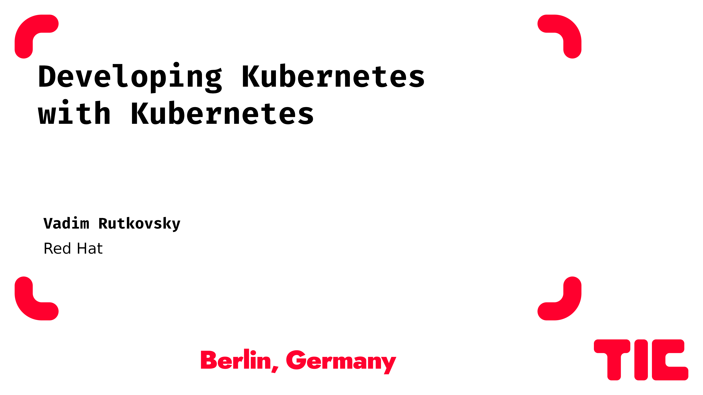
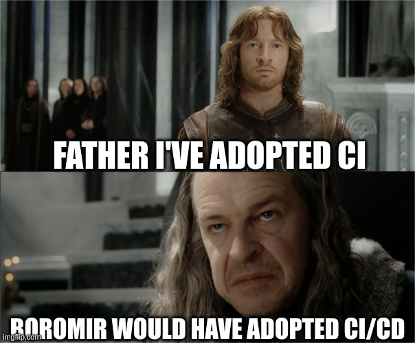
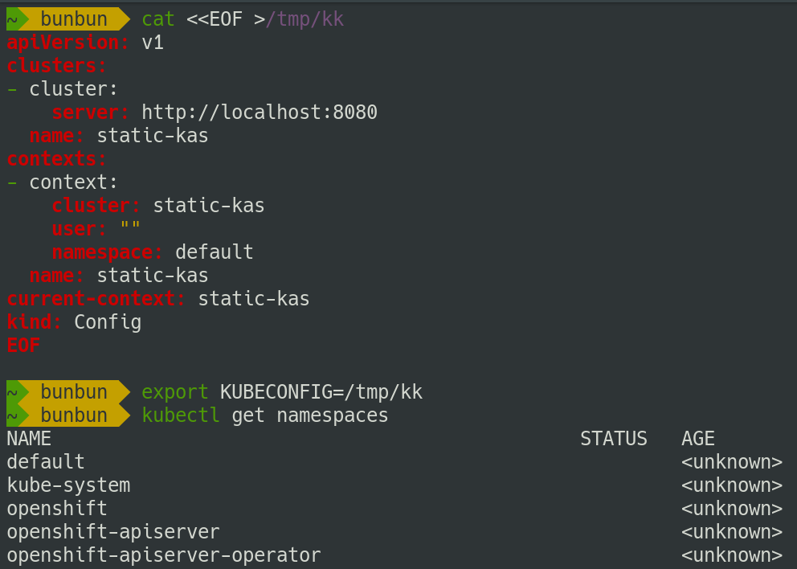

<!-- .slide: class="image-only" -->
#   

---
<!-- .slide: class="two-floating-elements" -->
### `kubectl auth whoami`

* Principal software engineer living in Czech Republic.

* Working for Red Hat in the OpenShift department.

Note:

My dayjob is working on control plane components - kube-apiserver mostly, but along the way I 
contribute to several other projects and k8s components. Let's dive in how these components 
are being developed, tested and assembled into distributions.

---
<!-- .slide: class="image-only" -->
### Continous Development

Note:

Similar to all modern projects Kubernetes has long adopted Continuous Integration approach.

Back in early days of k8s development CI system of choice was Jenkins, but SIG Testing 
has quickly hit its limitations. As a result, a new system to tailor to k8s-specific 
needs was created.

---
<!-- .slide: class="two-floating-elements" -->
### Prow - pull request-based CI/CD

* CRD-based system to schedule jobs

* Multicluster-capable

* Extendable with plugins

Note:

Unlike most CI/CD systems, Prow doesn't have a Web UI to show. Its CRD-based system, where 
jobs to run are encoded as k8s Custom Resources, it can natively schedule jobs across multiple 
clusters and can be extended with plugins or additional controllers.

---
### Prow - schedule tests

* Run additional tests using `/test` command

* Mark tests as required/optional

* Pre-submit/post-submit/periodic jobs

Note:

Prow allows working with CI via pull request comments - accessible to everyone and easily auditable. Instead of GUI users can run additional tests or rerun failures effortlessly issuing commands via pull request comments.

---
### Prow - labels

* Set PR metadata via comments

* Permissions via OWNERS file

Note:

Following kubernetes patterns Prow heavily relies on labels, as most important pull request metadata is persisted there. This enables SIG Testing to manage CI for the repo without constant repo permission update. Users are authorized via OWNERS file and similar to k8s labels PR labels are metadata: i.e. 'needs-ok-to-test' guards against malicious contributors, `hold` is used prevent merging until details are clarified etc.

---
<!-- .slide: class="image-only" -->
### Tide - labels

Note:

Tide is a component which performs merging of the PR: it waits for PR to have required tests 
passing and required labels present. Until then it shows a page where rules are explained and accessible to every contributor.

---
<!-- .slide: class="two-floating-elements" -->
### Tide - double approve

* `/approve` - high level agreement that a change makes sense

* `/lgtm` - code works and looks good

Note:

Each pull request requires high-level architectural approval and code-level "looks good to me", so that architects and component owners could perform different types of reviews.

---
### Tide - merge

* Double testing - once on PR pushes, once on merge

* Apply PR to latest master when PR is being merged

* Batch merging

Note:

Tide also runs tests twice - on every commit push and when final merge happens. This method protects code from state test results and ensures pull request applies to the latest code in branch. In order to optimize multiple sequential merges Tide can batch several pull requests as if they were one and run tests. If this fails PRs are tested and merged one by one.

---
<!-- .slide: class="image-only" -->
### Test Grid

Show job pass/fail history down to test cases

Note:

Now that we have multiple test jobs and suites running its useful to visualize their history. This is facilitated by TestGrid - an application which parses prow job results, including separate junit tests, and displays them as a grid, so that we could spot regressions and find their source easily. 
On this picture you can see that the test has failed a few times previously but then recovered.

---
<!-- .slide: class="two-floating-elements" -->
### Boskos

* Resource manager similar to k8s leases

* Ensure that test runs don't spend too much cloud bill

* Balance test runs across clouds

Note:

In order to avoid paying for test machines too much another component ensures a limited amount of machines is being created. Boskos (from Greek word shepard) requires a job to receive a lease (similar to Kubernetes leader election leases) out of the available pool or wait until such lease is available.

---
<!-- .slide: class="image-only" -->
### Intermission

Note:

Kubernetes as a project has a small set of delivered artifacts and even less so guarantees. If we look into k8s distributions world we'll see that they deliver a much wider range of artifacts and perform a lot more testing.

---
### OpenShift - k8s distribution

* Additional components - builds, images, routes

* Development - similar to k8s

Note:

Openshift is an opinionated k8s distribution, which is based around a pattern of operators. The operator pattern is a way to structure programs so that one application - operator - would continuously manage the lifecycle of another program - operand. Unlike vanilla k8s Openshift has batteries included - it already comes with Ingress, Network Plugin, Console and so on. 

However, Openshift relies heavily on k8s, so development process is designed to be as close to upstream k8s as possible (and vice versa) - we the same Prow, Tide and TestGrid tools as well.

---
<!-- .slide: class="image-only" -->
### OpenShift payload

* An image pointing to other components

* Contains an operator which applies components

Note:
As I mentioned previously Openshift is centered around operators, which is a significant departure from vanilla kubernetes. The openshift payload is an OCI image, which contains an operator deploying other operators. It also contains references to other operators, so in order to fetch openshift payload, you need to pull an image and all images referenced in it.

---
<!-- .slide: class="image-only" -->
### Release controller

* Displays available official / nightly versions

* Collects test results, shows changelog

Note:
Since Openshift has different release artifacts this also requires a different release controller. This is a custom app, tracking different Openshift releases (represented by ImageStreams) and groups them by version, displaying test information alongside. Here releases are considered "rejected" when 
important tests are not passing and a new nightly is delayed.

---
<!-- .slide: class="image-only" -->
### Blocking / informing jobs

Not all jobs are created equal

Note:
Some jobs are more important than the others, say if some exotic configuration test starts failing we won't stop producing nightlies. However support on major cloud providers is critical, so these tests are marked as release blocking. Note that some tests are aggregated, meaning this prowjob
is spawning 10 more prowjobs and aggregates their results to avoid random infrastructure failures.

---
<!-- .slide: class="image-only" -->
### Cluster bot

* Slack bot to spawn clusters. 

* Can run adhoc tests, build custom releases

Note:
Onboarding new engineers is hard, so in order to simplify internal adoption one of the first things we've created is a prowjob runner. This is a Slack bot, which can spawn a temporary cluster without 
running installer or configuration. Once the requested cluster is ready the bot produces a link to the console, default user and password along with admin kubeconfig.

This bot can also run arbitrary prowjobs and build a custom release applying a set of pull requests on top.

---
<!-- .slide: class="two-floating-elements" -->
### Must gather

* One archive to rule them all

* Bundle vital cluster information and logs

* Extendible with plugins

Note:

Another common issue our developers have hit is troubleshooting. Usually customers just give us a random log line and expect us to find the culprit in seconds. Sometimes its not that simple, so we 
developed a tool which automatically collects necessary information - cluster version, operator status,
pod logs, events and such. There are several teams creating additional products on top of OpenShift like Openshift Virtualization, so these teams have developed their own must-gather plugins to extend the collected minimum.

---
<!-- .slide: class="image-only" -->
### Kubernetes from static files

* `kubectl get pods` but from a set of yamls

Note:

Must-gathers however are just archives with enormous amount of YAML and nobody enjoys exploring them. In order to speed up the investigations we've created an app to parse must-gather archives and spawn a kube-like API server, so developer can just use `kubectl` and other tools to explore must-gather as if it was a live cluster.

---
<!-- .slide: class="image-only" -->
### Rehearsals

* Who tests the test system?

* Will this change break other repos?

Note:
Lets step back to CI problems now. As mentioned previously Prow is scheduling tests using custom CRDs, fetching its manifests from release git repository. However, updating these manifests is scary as you may accidentally break other teams' jobs.

This problem was sovled by introducing rehearsals - prow can try the proposed change and run specific tests. Once the tests are passing this PR requires additional approval label - `pj-rehearse ack` - to merge.

---
<!-- .slide: class="image-only" -->
### Test results page

* Pass / failed / flake tests

* Links to test artifacts / job history

Note:
Another set of customizations was made to the test results page. First lets look into what's displayed there. Below job name and its ID there are links to job history and artifacts page. Next comes a secton with tool links and finally a list of pass/failed/flaking tests.

---
<!-- .slide: class="image-only" -->
### Intervals chart

* Visualize events and their duration

* Find correlations between events

Note:
One of the commonly used test results tools is intervals chart. Using various sources like events, pod logs and synthetic test results we can put cluster events on the timeline and check for their correlations. Here we see an apiserver disruption has happened outside of shutdown periods, which usually means its a bug.

---
<!-- .slide: class="image-only" -->
### Aggregating logs - Loki

* Systems under test send logs to central log system

* Includes logs no longer present in must-gather

* Compare logs across multiple runs

Note:
Another powerfool tool we use in CI is persistent logging. Most test clusters we create are sending logs to central Loki system during their lifetime. Unlike must-gather this helps us with collecting logs from containers which were terminated. Also, LogQL is quite flexible when looking for specific log lines across several containers or even prowjobs.

---
<!-- .slide: class="image-only" -->
### Fetching metrics - PromeCIeus

* Spawn new Prometheus from test cluster metrics

Note:
Openshift comes included with Prometheus for monitoring various metrics. In test artifacts we also store Prometheus DB dump for further inspection. However importing them locally may take some time and effort, so we created a handy app to automatically spawn a temporary Prometheus instance from Prow job URL. This has proven to be particularly useful during pair investigations, as this instance is accessible by multiple engineers.

---
<!-- .slide: class="image-only" -->
### "Has this error been reported?"

Note:

Quite often folks are unsure if the problem has already been reported or report duplicate issues to component owners . To help with that we index prow job output, helping us quickly find jobs with similar error messages - this helps us find the breadth of the problems. Additionally we index active Jira tickets, so along with prowjob result you can also see if the problem has already been reported in the issue tracker too.

---
<!-- .slide: class="image-only" -->
### When did that start happening?

Note:
Search app also has a chart view, where one can see when the problem started occurring or has become more frequent. Here we see this issue happening from time to time previously, but has become more prevalent in last couple of hours.

---
### One app to rule them all - sippy

Too many jobs? Failures here and there?

Drink from the cup, not the firehose!

Note:
Openshift currently runs ~40000 prowjobs per day, so its hard to keep up with the state of problems. And - you guessed it - we created another tool to help with that. Introducing Sippy, but first a word from our sponsor.

---
<!-- .slide: class="image-only" -->
### What's this pokemon?

Note:

Anyone knows what this is?

---
<!-- .slide: class="image-only" -->
### What's this pokemon?

Note:
No, its not just a beer, its Guinness. Its known for maintaining the same taste and quality level over 200 years of its history.

---
<!-- .slide: class="image-only" -->
### Student and Fisher

* Student's statistical significance

* Fisher's exact test

Note:
This kind of quality control would be impossible without work of William Gosset, chief brewer for Guinness in the beginning of 20th century. under his pen name Student he developed a test to determine whether the change is statistically significant. Based on this work we use 95th percentile now, for example.

What does any of that has to do with OpenShift? We can use Student's statistical significance to find out whether failures in the job history are important to look into.

---
<!-- .slide: class="image-only" -->
### Finding regressions

Note:

Gosset's colleague Ronald Fisher expanded on his work and created a method to calculate the statistical probability of hypothesis based on this data.

Fisher's exact test helps us with probability of it being a regression, so we can set a severity for it.

---
<!-- .slide: class="image-only" -->
### Component readiness

Note:

Now that every job is associated with a cloud provider, CPU architecture, topology and such - and each test has an associated component and we can statistically determine regressions we can build a high-level overview of tests grouped by component. That way each team can get notified about new regressions and their scope. Here we can see that MicroShift deployments are looking good, kubelet has regressions on baremetal and kube-apiserver is not a happy bunny across every cloud platform.

---
### Summary

* CI is a lot more than "run tests"

* Help tools to help you

* Lies, damned lies and statistics

Note:

Now its time to wrap up, here's what we learned - CI is a treasure trove of release information.

Building tools helps developers feel engaged and custom tools are usually helping developers be much more productive.

And finally, statistics may be fantastic source of new information, but it requires a careful interpretation.

And that's all I have for today, thank you, hopefully there are some questions?

---
## Thanks + Questions

Find me at https://vrutkovs.eu

https://vrutkovs.github.io/slides-developing-k8s-with-k8s/
