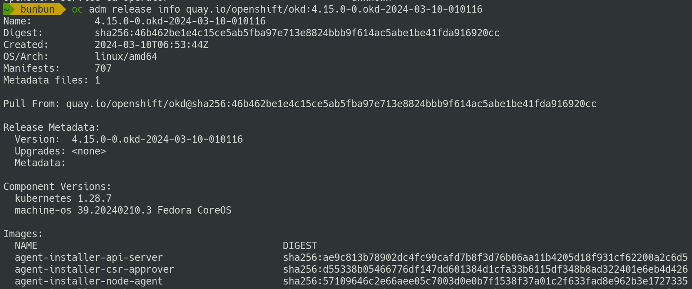

## Developing Kubernetes with Kubernetes
 
 
 
Vadim Rutkovsky

vrutkovs@redhat.com

---
<!-- .slide: class="two-floating-elements" -->
### `whoami`

* Principal software engineer living in Czech Republic.

* Working for Red Hat in the OpenShift department.

Note:

My dayjob is working on control plane components - kube-apiserver mostly, but along the way I 
contribute to several other projects and k8s components. Lets dive in how these components 
are being developed, tested and assembled into distributions.

---
### How the sausage gets made

Note:

Back in early times of k8s development CI/CD of choice was Jenkins, but SIG Testing 
has quickly hit its limitations. As a result, a new system to tailor to k8s-specific 
needs was created.

---
<!-- .slide: class="two-floating-elements" -->
### Prow - pull request-based CI/CD

* CRD-based system to schedule jobs

* Multicluster-capable

* Extendable with plugins

Note:

Unlike most CI/CD systems, Prow doesn't have a Web UI to show. Its CRD-based system, where 
jobs to run are encoded as k8s Custom Resources, it can natively schedule jobs across multiple 
clusters and can be extended with plugins or other controllers.

---
### Prow - schedule tests

* Run additional tests using `/test` command

* Mark tests as required/optional

* Pre-submit/post-submit/periodic jobs

Note:

Prow allows working with CI via pull request comments - accessible to everyone. Instead of 
GUI users can run additional tests or rerun failures effortlessly.

---
### Prow - labels

* Set PR metadata via comments

* Permissions via OWNERS file

Note:

Most important Prow feature is ability to manage CI for the repo without administrative permissions.
Users are authorized via OWNERS file and similar to k8s labels PR labels are metadata: i.e. 
'needs-ok-to-test' guards against malicious contributors, `hold` means prevent merging etc. 

---
### Tide - labels

Note:

Tide is a component which performs merging of the PR: it waits for PR to have required tests 
passing and required labels present. Until then it shows a page where rules are explained.

---
<!-- .slide: class="two-floating-elements" -->
### Tide - double approve

* `/approve` - high level agreement that a change makes sense

* `/lgtm` - code works and looks good

Note:

---
### Tide - merge

* Double testing - once on PR pushes, once on merge

* Apply PR to latest master when PR is being merged

* Batch merging

Note:

---
### Test Grid

Show job pass/fail history down to test cases

Note:

---
<!-- .slide: class="two-floating-elements" -->
### Boskos

* Resource manager similar to k8s leases

* Ensure that test runs don't spend too much cloud bill

* Balance test runs across clouds

Note:

---
### Intermission

Note:

---
<!-- .slide: class="two-floating-elements" -->
### OpenShift - k8s distribution

* Additional components - builds, images, routes

* Development - similar to k8s

Note:

---
<!-- .slide: class="two-floating-elements" -->
### OpenShift payload

* An image pointing to other components

* Contains an operator which applies components

Note:

---
### Release controller

* Displays available official / nightly versions

* Collects test results, shows changelog

Note:

---
### Blocking / informing jobs

Not all jobs are created equal

Note:

---
<!-- .slide: class="two-floating-elements" -->
### Cluster bot

Slack bot to spawn clusters. Can run adhoc tests, build custom releases

Note:

---
<!-- .slide: class="two-floating-elements" -->
### Must gather

* https://github.com/openshift/must-gather

* One archive to rule them all

* Bundle vital cluster information and logs

* Extendible with plugins

Note:

---
<!-- .slide: class="two-floating-elements" -->
### Kubernetes from static files

* `kubectl get pods` but from a set of yamls

Note:

---
<!-- .slide: class="two-floating-elements" -->
### Rehearsals

* Who tests the test system?

* Will this change break other repos?

Note:

---
<!-- .slide: class="two-floating-elements" -->
### Test results page

* Pass / failed / flake tests

* Links to test artifacts / job history

Note:

---
<!-- .slide: class="two-floating-elements" -->
### Intervals chart

* Visualize events and their duration

* Find correlations between events

Note:

---
<!-- .slide: class="two-floating-elements" -->
### Aggregating logs - Loki

* Systems under test send logs to central log system

* Includes logs no longer present in must-gather

* Compare logs across multiple runs

Note:

---
<!-- .slide: class="two-floating-elements" -->
### Fetching metrics - PromeCIeus

* Spawn new Prometheus from test cluster metrics

Note:

---
### "Has this error been reported?"

---
### When did that start happening?

Note:

---
### One app to rule them all - sippy

Drink from the cup, not the firehose!

Note:

---
### What's this pokemon?

Note:

---
### What's this pokemon?

Note:

---
### Student and Fisher

* Student's statistical significance

* Fisher's exact test

Note:

---
### Finding regressions

Note:

---
### Component readiness

Note:

---
### Summary

* CI is a lot more than "run tests"

* Help tools to help you

* Lies, damned lies and statistics

Note:

---
## Thanks + Questions

Find me at https://vrutkovs.eu

https://vrutkovs.github.io/slides-developing-k8s-with-k8s/
