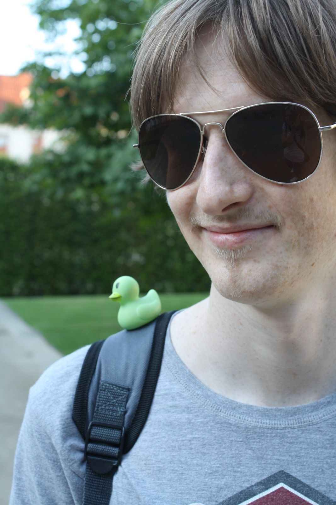

## Developing Kubernetes with Kubernetes
 
 
 
Vadim Rutkovsky

vrutkovs@redhat.com

---
<!-- .slide: class="two-floating-elements" -->
### `whoami`

* Principal software engineer living in Czech Republic.

* Working for Red Hat in the OpenShift department.

Note:

My dayjob is working on control plane components - kube-apiserver mostly, but along the way I 
contribute to several other projects and k8s components.

---
### Thanks + Questions

Find me at https://vrutkovs.eu

https://vrutkovs.github.io/slides-developing-k8s-with-k8s/
